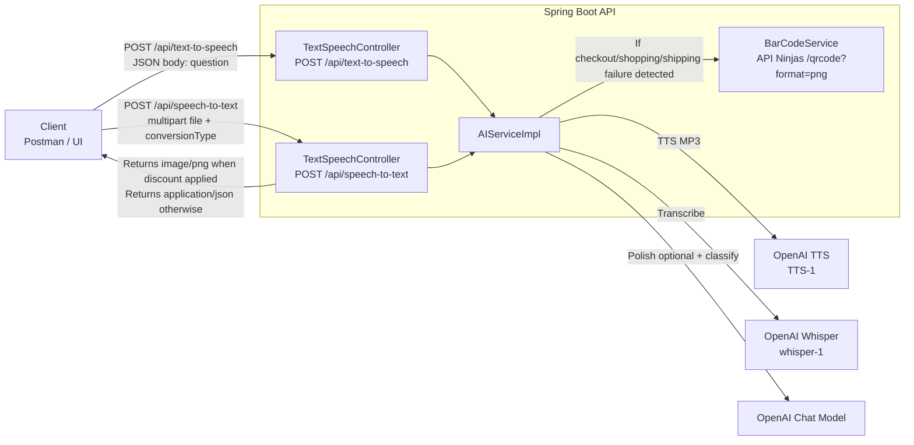
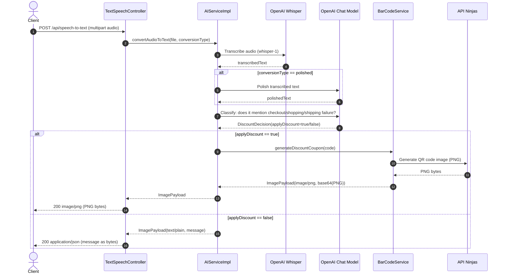

# AI Text & Speech (OpenAI + Spring Boot)

This Spring Boot API integrates with OpenAI models to:

1. **Generate audio from text** (Text → Speech).
2. **Read audio and transcribe it to text** (Speech → Text).
3. **Detect checkout / shopping flow failures** from the transcribed text using an LLM.
4. If a failure is detected, **recommend/generate** a discount coupon and return a **QR code image (PNG)**.

---

## High-level design

### System diagram

> Mermaid rendering depends on your Markdown viewer.
> - **GitHub**: Mermaid usually renders automatically in `.md` files.
> - **JetBrains Markdown preview**: enable **Settings → Languages & Frameworks → Markdown → Mermaid** (or install a Mermaid plugin).
> If Mermaid isn't available, the rest of the README still describes the flow.



### Discount decision flow



---

## API endpoints

### 1) Text → Speech

**Request**
- `POST /api/text-to-speech`
- `Content-Type: application/json`

Body:
```json
{ "question": "Hello! This will be converted to audio." }
```

**Response**
- `200 OK`
- `Content-Type: audio/mpeg`
- Body: MP3 bytes

---

### 2) Speech → Text (+ discount recommendation)

**Request**
- `POST /api/speech-to-text`
- `Content-Type: multipart/form-data`

Form fields:
- `file` (required): audio file
- `conversionType` (optional): `raw` (default) or `polished`

**Behavior**
- Audio is transcribed using Whisper.
- If `conversionType=polished`, the transcript is cleaned up with an LLM.
- The LLM checks whether the transcript contains references to failures in:
  - checkout flows
  - shopping flows
  - shipping flows
- If yes → generates a discount coupon QR code and returns it as a PNG image.

**Response contract (matches current controller behavior)**
- If discount is recommended:
  - `200 OK`
  - `Content-Type: image/png`
  - Body: PNG bytes (QR code image)
- If discount is not recommended:
  - `200 OK`
  - `Content-Type: application/json`
  - Body: currently the service message is returned as raw bytes

---

## Configuration

`src/main/resources/application.yml`

```yaml
spring:
  ai:
    openai:
      api-key: ${OPENAI_API_KEY}

app:
  blocked-words:
    - umm
    - ahhh
    - youknow

ninjas:
  api:
    key: ${NINJAS_API_KEY}
```

### Required environment variables

- `OPENAI_API_KEY` – OpenAI API key
- `NINJAS_API_KEY` – API Ninjas key (QR code generation)

---

## Run locally

```bash
./mvnw spring-boot:run
```

Server runs on `http://localhost:8080`.

---

## Notes / Implementation details

- The discount decision is made in `AIServiceImpl#checkIfDiscount(...)` using a structured output (`BeanOutputConverter<DiscountDecision>`).
- The coupon code currently uses a placeholder (`DISCOUNT2024`). Swap this to generate unique codes.
- `BarCodeService` uses API Ninjas **`/qrcode`** with `format=png`, so the image is technically a **QR code** (not a 1D barcode).

---

## Troubleshooting

- **Getting 400 Invalid conversionType**: Use only `raw` or `polished`.
- **No PNG returned**: The API returns PNG only when a discount is recommended by the LLM and Ninja API key is configured.
- **Mermaid diagram not rendering**: enable Mermaid support in your Markdown viewer (see note above).
- **OpenAI errors**: verify `OPENAI_API_KEY` is set and your account has access to Whisper/TTS.
